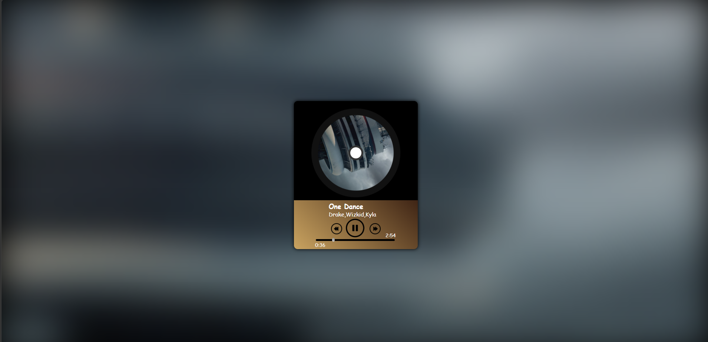

# Music Player
A web-based music player built using HTML, CSS, and Javascript.

## Features
- Play and pause music
- Previous and nect track controlls
- Current song duration
- Dynamical albuym artwork
- Animatedvinyl record
- Responsive UI
- Interactive progress bar

## Technologies
- HTML5
- CSS3
- Javascript
- HTML Audio API

## Screenshots

## Future Improvements
- Volume control
- Playlist support
- Shuffle and repeat fucntions
- Responsive mobile design

### Notes
The music files are not included in this repository due to copyright restrictions.  
